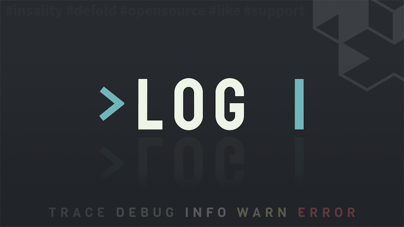

[](https://github.com/sponsors/insality) [](https://ko-fi.com/insality) [](https://www.buymeacoffee.com/insality)

[](https://github.com/Insality/defold-log/tags)

# Log

**Log** - is a single file Lua library for [Defold](https://defold.com/) game engine, enabling efficient logging for game development. It simplifies debugging and monitoring by allowing developers to generate detailed logs that can be adjusted for different stages of development.

## Features

- **Log Levels**: Includes TRACE, DEBUG, INFO, WARN, and ERROR for varied detail in logging.
- **Build-specific Logging**: Allows changing log verbosity between debug and release builds.
- **Detailed Context**: Supports logging with additional information for context, such as variable values or state information.
- **Format Customization**: Allows customizing the log message format.
- **Performance Tracking**: Provides features to log execution time and memory use.

## Setup

### [Dependency](https://www.defold.com/manuals/libraries/)

Open your `game.project` file and add the following line to the dependencies field under the project section:

**[Log](https://github.com/Insality/defold-log/archive/refs/tags/4.zip)**

```
https://github.com/Insality/defold-log/archive/refs/tags/4.zip
```

### Library Size

> **Note:** The library size is calculated based on the build report per platform

| Platform         | Library Size |
| ---------------- | ------------ |
| HTML5            | **2.55 KB**  |
| Desktop / Mobile | **4.29 KB**  |

### Configuration

You have the option to configure logging preferences directly within your `game.project` file. This allows you to adjust log levels, format, and performance tracking options.

This is a default configuration for the Log module:

```ini
[log]
level = TRACE
level_release = ERROR
logger_block_width = 16
info_block = %levelname[%logger]
message_block = %tab%message: %context %tab<%function>
max_log_length = 1024
inspect_depth = 1
```

This configuration section for `game.project` defines various settings:

| Setting             | Description                                                                                                                                                                                                 |
|---------------------|-------------------------------------------------------------------------------------------------------------------------------------------------------------------------------------------------------------|
| **level**           | Sets the default logging level for development builds. In this case, `TRACE` and above levels will be logged, providing detailed information for debugging and monitoring.                                   |
| **level_release**   | Determines the logging level for release builds, where `ERROR` and above levels will be logged, focusing on warnings and errors that are critical for a production environment. Use `FATAL` to silence all logs. |
| **info_block**      | Defines the format of the info block in log messages, which includes the log level and logger name in this configuration.                                                                                     |
| **message_block**   | Sets the format for the message block, including the actual log message, any context provided, and the function from which the log was called.                                                               |
| **logger_block_width** | Defines the width of the logger block in log messages. This helps in aligning log messages for better readability. Default is 14.                                                                          |
| **max_log_length**  | The maximum length of the log message. If the message exceeds this length, it will be truncated. Default is 1024.                                                                                            |
| **inspect_depth**   | The maximum depth of nested tables to inspect when logging. Default is 1.                                                                                                                                    |

In the `[log]` configuration section for `game.project`, the `info_block` and `message_block` fields allow for dynamic content based on specific placeholders. These placeholders get replaced with actual log information at runtime, providing structured and informative log messages.

#### Info Block Placeholders:

| Placeholder          | Description                                                                                                                                                                                                 |
|----------------------|-------------------------------------------------------------------------------------------------------------------------------------------------------------------------------------------------------------|
| **%logger**          | The name of the logger instance producing the log message. Helps in identifying the source of the log message.                                                                                               |
| **%levelname**       | The name of the log level (e.g., DEBUG, INFO, WARN, etc.). Provides clarity on the severity or nature of the log message. Should be placed at the beginning of the log message for color highlighting in the Defold Console. |
| **%time_tracking**   | The time elapsed since the last entry in this logger instance. Time tracking will be enabled, if this placeholder is used.                                                                                   |
| **%memory_tracking** | The memory allocated since the last entry in this logger instance. Memory tracking will be enabled, if this placeholder is used.                                                                             |
| **%chronos_tracking**| The time elapsed since the last entry in this logger instance. Chronos extension will be used, if this placeholder is used.                                                                                  |

#### Message Block Placeholders:

| Placeholder  | Description                                                                                                                                                                                                 |
|--------------|-------------------------------------------------------------------------------------------------------------------------------------------------------------------------------------------------------------|
| **%tab**     | A tab character for formatting log messages.                                                                                                                                                                |
| **%space**   | A space character for formatting log messages.                                                                                                                                                              |
| **%message** | The actual log message content. This is the primary information you want to log.                                                                                                                            |
| **%context** | Any additional context provided along with the log message. It can be useful for providing extra information relevant to the log message (e.g., variable values, state information).                        |
| **%function**| The function name or location from where the log message was generated. Helps in pinpointing where in the codebase a particular log message is coming from, aiding in debugging.                             |


#### Output Prefabs

**Info:** `%levelname[%logger]`
**Message:** `%space%message: %context %tab<%function>`
**Preview:**

```
DEBUG:[game.logger     ] Debug message: {debug: message, value: 2} 	<example/example.gui_script:17>
```

---

**Info:** `%levelname| %time_tracking | %memory_tracking | %logger`
**Message:** `| %tab%message: %context %tab<%function>`
**Preview:**

```
DEBUG:| 166.71ms |   2.4kb | game.logger      |	Delayed message: just string 	<example/example.gui_script:39>
```

### Memory Tracking

To enable memory tracking, add `%memory_tracking` to the `info_block` in the `game.project` file:

```ini
info_block = %levelname| %memory_tracking | %logger
```

This will include memory tracking information in the log messages, showing the memory allocated since the last entry in this logger instance.

>DEBUG:|   2.4kb | game.logger      |	Delayed message: just string 	<example/example.gui_script:39>`.

Works only in debug mode, automatically disabled in release mode.


### Time Tracking

To enable time tracking, add `%time_tracking` to the `info_block` in the `game.project` file:

```ini
info_block = %levelname| %time_tracking | %logger
```

This will include time tracking information in the log messages, showing the time elapsed since the last entry in this logger instance.

>DEBUG:|  0.01ms | game.logger      |	Delayed message: just string 	<example/example.gui_script:39>`.


### Using High Resolution Timer Extension

The Log module can utilize the Chronos extension for Defold to enable time tracking with microsecond or better precision (`QueryPerformanceCounter` on Windows). This is optional.

If you want to use the extension, add the following line to the dependencies field in your `game.project` file:

**[defold-chronos](https://github.com/d954mas/defold-chronos)**
```
https://github.com/d954mas/defold-chronos/archive/refs/tags/1.0.1.zip
```

Then to use the high-resolution timer, you need to add `%chronos_tracking` to the `info_block` in the `game.project` file:

```ini
[log]
info_block = %levelname| %chronos_tracking | %logger
```

This will include time tracking information in the log messages, showing the time elapsed since the last entry in this logger instance.

>DEBUG:|  0.00001ms | game.logger      |	Delayed message: just string 	<example/example.gui_script:39>`.


### Using Native UTF8 Extension

The Log module can utilize the native UTF8 extension for Defold to handle UTF-8 strings. This is optional but recommended for better performance.

If you want to use the native UTF8 extension, add the following line to the dependencies field in your `game.project` file:

**[defold-utf8](https://github.com/d954mas/defold-utf8)**
```
https://github.com/d954mas/defold-utf8/archive/master.zip
```

The Log module automatically detects the presence of the native UTF8 extension and uses it if available. If the extension is not present, the Log module will use the built-in Lua string functions.

## API Documentation

### Quick API Reference

```lua
local log = require("log.log")
log:trace(message, [data])
log:debug(message, [data])
log:info(message, [data])
log:warn(message, [data])
log:error(message, [data])

-- Create a new logger instance with a specific logger name
local logger = log.get_logger(logger_name, [force_logger_level_in_debug])
logger:trace(message, [data])
logger:debug(message, [data])
logger:info(message, [data])
logger:warn(message, [data])
logger:error(message, [data])
```

### Setup and Initialization

To start using the Log module in your project, you first need to import it. This can be done with the following line of code:

```lua
local log = require("log.log")
```

> The log module itself is logger instance with name equals to `project.title`. All `logger` methods can be invoked on `log` module itself. But general practice it to create a specific logger for each module.

### Core Functions

**log.get_logger**
---
```lua
log.get_logger(logger_name, [force_logger_level_in_debug])
```
Create a new logger instance with an optional forced log level for debugging purposes.

- **Parameters:**
  - `logger_name`: A string representing the name of the logger.
  - `force_logger_level_in_debug` (optional): A string representing the forced log level when in debug mode (e.g., "DEBUG", "INFO").

- **Return Value:** A new logger instance.

- **Usage Example:**

```lua
local my_logger = log.get_logger("game.logger")
```

### Logger Instance Methods

Once a logger instance is created, you can use the following methods to log messages at different levels. Each logging method allows including optional data for context, which can be especially useful for debugging. However, note that passing data can lead to additional memory allocation, which might impact performance.

**logger:trace**
---
```lua
logger:trace(message, [data])
```
Log a message at the TRACE level. Trace is typically used to log the start and end of functions or specific events. While it's not recommended to pass data to trace due to potential memory allocation, sometimes it can be useful for in-depth debugging.

- **Parameters:**
  - `message`: The log message.
  - `data` (optional): Additional data to include with the log message.

- **Usage Example:**

```lua
my_logger:trace("Trace message")

-- TRACE:[game.logger     ]	Trace message:  	<example/example.gui_script:55>
-- TRACE:|   0.01ms |   0.4kb | game.logger     | 	Trace message:  	<example/example.gui_script:54>
```

**logger:debug**
---
```lua
logger:debug(message, [data])
```
Log a message at the DEBUG level. Debug is suitable for detailed system information that could be helpful during development to track down unexpected behavior.

- **Usage Example:**

```lua
my_logger:debug("Debug message", { key = "value" })

-- DEBUG:[game.logger     ]	Debug message: {key: value} 	<example/example.gui_script:56>
-- DEBUG:|   0.00ms |   0.1kb | game.logger     | 	Debug message: {key: value} 	<example/example.gui_script:55>
```

**logger:info**
---
```lua
logger:info(message, [data])
```
Log a message at the INFO level. Info is used for general system information under normal operation.

- **Usage Example:**

```lua
my_logger:info("Info message", { key = "value" })

-- INFO: [game.logger     ]	Info message: {key: value} 	<example/example.gui_script:57>
-- INFO: |   0.00ms |   0.1kb | game.logger     | 	Info message: {key: value} 	<example/example.gui_script:56>
```

**logger:warn**
---
```lua
logger:warn(message, [data])
```
Log a message at the WARN level. Warn is intended for potentially harmful situations that could require attention.

- **Usage Example:**

```lua
my_logger:warn("Warn message", { key = "value" })

-- WARN: [game.logger     ]	Warn message: {key: value} 	<example/example.gui_script:58>
-- WARN: |   0.00ms |   0.1kb | game.logger     | 	Warn message: {key: value} 	<example/example.gui_script:57>
```

**logger:error**
---
```lua
logger:error(message, [data])
```
Log a message at the ERROR level. Error indicates serious issues that have occurred and should be addressed immediately.

- **Usage Example:**

```lua
my_logger:error("Error message", {error = "file not found"})

-- ERROR:[game.logger     ]	Error message: {key: value} 	<example/example.gui_script:59>
-- ERROR:|   0.00ms |   0.1kb | game.logger     | 	Error message: {key: value} 	<example/example.gui_script:58>
```

These methods provide a comprehensive logging solution, allowing you to capture detailed information about your application's behavior, performance, and issues across different stages of development.


## Usage Examples

### Basic Logging

```lua
local log = require("log.log")

-- Create logger instances for different components of your game
local logger = log.get_logger("game.logger")

function init(self)
    logger:trace("init")
    logger:debug("Debugging game start", { level = 1, start = true })
    logger:info("Game level loaded")
    logger:warn("Unexpected behavior detected", "context_can_be_any_type")
    logger:error("Critical error encountered", { error = "out of memory" })
end

```

### Use Cases

Read the [Use Cases](USE_CASES.md) file for detailed examples of how to use the Log module in different scenarios.


## License

This project is licensed under the MIT License - see the LICENSE file for details.


## Issues and Suggestions

For any issues, questions, or suggestions, please [create an issue](https://github.com/Insality/defold-log/issues).

To contribute, please look for issues tagged with `[Contribute]`, solve them, and submit a PR focusing on performance and code style for efficient and maintainable enhancements. Your contributions are greatly appreciated!


## 👏 Contributors

<a href="https://github.com/Insality/defold-log/graphs/contributors">
  
</a>


## Changelog

<details>

### **V1**
- Initial release

### **V2**
- Add chronos extension support

### **V3**
- [#1] Add inspect_depth settings to game.project
- [#2] Add max_log_length settings to game.project

### **V4**
- Now log module can be used as logger itself

### **V5**
- Add `FATAL` level for silent all logs
- Changed module settings
	- For better visualisation of logs in Defold Console with level highlighting

</details>


## ❤️ Support the Project ❤️

Your support motivates me to keep creating and maintaining projects for **Defold**. Consider supporting if you find my projects helpful and valuable.

[](https://github.com/sponsors/insality) [](https://ko-fi.com/insality) [](https://www.buymeacoffee.com/insality)

