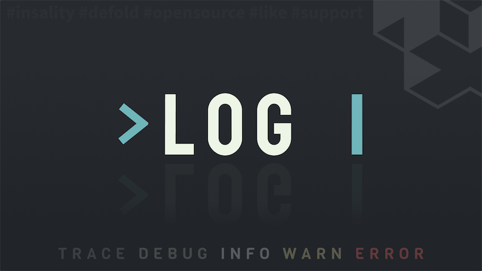

[](https://github.com/sponsors/insality) [](https://ko-fi.com/insality) [](https://www.buymeacoffee.com/insality)

[](https://github.com/Insality/defold-log/tags)

# Log

**Log** - is a library for [Defold](https://defold.com/) game engine, enabling efficient logging for game development. It simplifies debugging and monitoring by allowing developers to generate detailed logs that can be adjusted for different stages of development.

## Features

- **Log Levels**: Includes TRACE, DEBUG, INFO, WARN, ERROR, and FATAL for varied detail in logging.
- **Build-specific Logging**: Allows changing log verbosity between debug and release builds.
- **Detailed Context**: Supports logging with additional information for context, such as variable values or state information.
- **Format Customization**: Allows customizing the log message format.
- **Performance Tracking**: Provides features to log execution time and memory use.
- **Callbacks**: Add custom handlers for remote logging, analytics, or extra processing.
- **File Logging**: Write all logs to one file (`set_file` / `log.file`) and/or to a per-logger file next to the script.

## Setup

### [Dependency](https://www.defold.com/manuals/libraries/)

Open your `game.project` file and add the following line to the dependencies field under the project section:

**[Log](https://github.com/Insality/defold-log/archive/refs/tags/7.zip)**

```
https://github.com/Insality/defold-log/archive/refs/tags/7.zip
```

### Library Size

> **Note:** The library size is calculated based on the build report per platform

| Platform         | Library Size |
| ---------------- | ------------ |
| HTML5            | **2.55 KB**  |
| Desktop / Mobile | **4.29 KB**  |

### Configuration [optional]

Read the [Configuration](docs/CONFIGURATION.md) file for detailed information on how to configure the Log module.

### Default view


## API Documentation

### Quick API Reference

```lua
-- You can use log module as logger itself; the name will be the current script file name.
local log = require("log.log")
log:trace(message, [data])
log:debug(message, [data])
log:info(message, [data])
log:warn(message, [data])
log:error(message, [data])

-- Custom handlers for log messages
log.add_callback(function(logger, level, message, context, log_message) end)
log.remove_callback(callback)
log.clear_callbacks()

-- File logging
log.set_file("/logs/game.log") -- all loggers → one file
log.get_file()
log:set_file_nearby()         -- this logger → nearby .log
log.final()                   -- call once on app shutdown
log.clear_log_files()

-- Create a new logger instance with a specific logger name.
-- Default logger name is file name of the current script.
local logger = log.get_logger([logger_name], [force_logger_level_in_debug])
logger:trace(message, [data])
logger:debug(message, [data])
logger:info(message, [data])
logger:warn(message, [data])
logger:error(message, [data])
logger:set_file_nearby()

-- Short version
local logger = require("log.log")()
local logger = require("log.log")([name], [level])
```

### Setup and Initialization

To start using the Log module in your project, you first need to import it. This can be done with the following line of code:

```lua
local log = require("log.log")
```

> The log module itself is a logger instance. All `logger` methods can be invoked on the `log` module itself. The usual practice is to create a specific logger for each module.

### Core Functions

**log.get_logger**
---
```lua
log.get_logger([logger_name], [force_logger_level_in_debug])
```
Create a new logger instance with an optional forced log level for debugging purposes.

- **Parameters:**
  - `logger_name`: A string representing the name of the logger. Default is file name of the current script.
  - `force_logger_level_in_debug` (optional): A string representing the forced log level when in debug mode (e.g., "DEBUG", "INFO").

- **Return Value:** A new logger instance.

- **Usage Example:**

```lua
local my_logger = log.get_logger("game.logger")
```

**log.add_callback / log.remove_callback / log.clear_callbacks**
---
```lua
log.add_callback(callback)
log.remove_callback(callback)
log.clear_callbacks()
```
Add custom handlers for log messages. Callbacks run in addition to the default console output. Use them for remote logging, analytics, or extra processing.

`clear_callbacks()` removes only your callbacks, the file writing is not affected.

- **Callback parameters:** `(logger, level, message, context, log_message)`
  - `logger`: The logger instance that generated the log
  - `level`: The log level (TRACE, DEBUG, INFO, WARN, ERROR, FATAL)
  - `message`: The original message string
  - `context`: Any additional context data passed to the log function
  - `log_message`: The formatted log message string (as it appears in console)

- **Usage Example:**

```lua
local function on_log(logger, level, message, context, log_message)
    if level == "ERROR" then
        -- send to analytics / remote logger
    end
end

log.add_callback(on_log)
log.remove_callback(on_log)
log.clear_callbacks()
```

**log.set_file / logger:set_file_nearby / log.final / log.clear_log_files**
---
```lua
log.set_file(path)          -- all loggers → one file
log.set_file(nil)           -- disable the shared file
logger:set_file_nearby()    -- this logger → nearby .log
log.final()
log.clear_log_files()
```

Two ways to write logs to disk (can be combined):

1. **Shared file** — every logger writes to one file:
   - `log.set_file("/logs/game.log")`
   - or in `game.project`: `file = /logs/game.log`
   - Path is always relative (`/logs/game.log`) → project folder in editor, save directory on device
2. **Per-logger file** — `set_file_nearby()` writes only that logger to `<logger_name>.log` next to the script. Editor and desktop builds only, since it requires the project folder. If the logger has an auto name, the script basename is used instead.

- Call `log.final()` **once** on application shutdown (from your main/bootstrap script `final`) to flush, close and disable the files. Further messages will not reopen them.
- `clear_log_files()` deletes known `.log` files from disk.

```lua
local log = require("log.log")

-- All logs from all loggers:
log.set_file("/logs/game.log")

local logger = log.get_logger("combat")
-- Optional extra split file for this logger only:
logger:set_file_nearby()

-- In your main collection script (call once for the whole project):
function final(self)
    log.final()
end
```

### Logger Instance Methods

Once a logger instance is created or directly called from log module, you can use the following methods to log messages at different levels. Each logging method allows including optional data for context, which can be especially useful for debugging. However, note that passing data can lead to additional memory allocation, which might impact performance.

**logger:trace**
---
```lua
logger:trace(message, [data])
```
Log a message at the TRACE level. Trace is typically used to log the start and end of functions or specific events. While it's not recommended to pass data to trace due to potential memory allocation, sometimes it can be useful for in-depth debugging.

- **Parameters:**
  - `message`: The log message. If `nil`, memory/time tracking is still updated without printing.
  - `data` (optional): Additional data to include with the log message.

- **Usage Example:**

```lua
my_logger:trace("Trace message")

-- TRACE:|   0.01ms |   0.4kb | game.logger     | 	Trace message:  	<example/example.gui_script:54>
```

**logger:debug**
---
```lua
logger:debug(message, [data])
```
Log a message at the DEBUG level. Debug is suitable for detailed system information that could be helpful during development to track down unexpected behavior.

- **Usage Example:**

```lua
my_logger:debug("Debug message", { key = "value" })

-- DEBUG:|   0.00ms |   0.1kb | game.logger     | 	Debug message: {key: value} 	<example/example.gui_script:55>
```

**logger:info**
---
```lua
logger:info(message, [data])
```
Log a message at the INFO level. Info is used for general system information under normal operation.

- **Usage Example:**

```lua
my_logger:info("Info message", { key = "value" })

-- INFO: |   0.00ms |   0.1kb | game.logger     | 	Info message: {key: value} 	<example/example.gui_script:56>
```

**logger:warn**
---
```lua
logger:warn(message, [data])
```
Log a message at the WARN level. Warn is intended for potentially harmful situations that could require attention.

- **Usage Example:**

```lua
my_logger:warn("Warn message", { key = "value" })

-- WARN: |   0.00ms |   0.1kb | game.logger     | 	Warn message: {key: value} 	<example/example.gui_script:57>
```

**logger:error**
---
```lua
logger:error(message, [data])
```
Log a message at the ERROR level. Error indicates serious issues that have occurred and should be addressed immediately.

- **Usage Example:**

```lua
my_logger:error("Error message", {error = "file not found"})

-- ERROR:|   0.00ms |   0.1kb | game.logger     | 	Error message: {key: value} 	<example/example.gui_script:58>
```

These methods provide a comprehensive logging solution, allowing you to capture detailed information about your application's behavior, performance, and issues across different stages of development.


## Usage Examples

### Basic Logging

```lua
local log = require("log.log")

-- Create logger instances for different components of your game
local logger = log.get_logger("game.logger")

function init(self)
    logger:trace("init")
    logger:debug("Debugging game start", { level = 1, start = true })
    logger:info("Game level loaded")
    logger:warn("Unexpected behavior detected", "context_can_be_any_type")
    logger:error("Critical error encountered", { error = "out of memory" })
end

```

### Use Cases

Read the [Use Cases](docs/USE_CASES.md) file for detailed examples of how to use the Log module in different scenarios.


## License

This project is licensed under the MIT License - see the LICENSE file for details.


## Issues and Suggestions

For any issues, questions, or suggestions, please [create an issue](https://github.com/Insality/defold-log/issues).

To contribute, please look for issues tagged with `[Contribute]`, solve them, and submit a PR focusing on performance and code style for efficient and maintainable enhancements. Your contributions are greatly appreciated!


## 👏 Contributors

<a href="https://github.com/Insality/defold-log/graphs/contributors">
  
</a>


## Changelog

<details>

### **V1**
- Initial release

### **V2**
- Add chronos extension support

### **V3**
- [#1] Add inspect_depth settings to game.project
- [#2] Add max_log_length settings to game.project

### **V4**
- Now log module can be used as logger itself

### **V5**
- Add `FATAL` level for silent all logs
	- Designed for release builds
- Now logger name is optional, by default it's file name of the current script.
- Changed default Log module settings
	- Improved visualization and color highlighting in Defold Console
- Removed time and memory tracking options from `game.project`
	- Now it's possible to use `%time_tracking` and `%memory_tracking` placeholders in `info_block` to track time and memory usage.
	- For time tracking with chronos extension, use the `%chronos_tracking` placeholder.

### **V6**
- Add shortcuts to create logger instance:
```lua
local log = require("log.log")
local logger = log.get_logger("name")
local logger = log.get_logger("name", "TRACE")

local logger = require("log.log")()
local logger = require("log.log")("name")
local logger = require("log.log")("name", "TRACE")
```
- Add auto-name for loggers from log.* interface, it will match the file name of the current script.
So now the shortest way to use log module is:
```lua
local log = require("log.log")

log:trace("Hello, world!", { key = "value" })
log:info("Hello, world!")
log:error("Hello, world!")
```

### **V7**
- Refactor into modules: `log/internal/config.lua`, `formatter.lua`, `file_writer.lua`
- Add callback API: `add_callback`, `remove_callback`, `clear_callbacks`
- Add file logging: `set_file`, `set_file_nearby`, `final`, `clear_log_files`
- Add `info_block_release` setting, so the tracking placeholders can't leak into a release build
- Allow `nil` message (e.g. `logger:debug()`) to update memory/time tracking without printing
- Fix: `%` inside a message, a context or a logger name no longer breaks the formatting
- Fix: `force_logger_level_in_debug` is now ignored in release builds, as its name implies
- Move detailed docs to `docs/CONFIGURATION.md` and `docs/USE_CASES.md`

</details>


## ❤️ Support the Project ❤️

Your support motivates me to keep creating and maintaining projects for **Defold**. Consider supporting if you find my projects helpful and valuable.

[](https://github.com/sponsors/insality) [](https://ko-fi.com/insality) [](https://www.buymeacoffee.com/insality)

